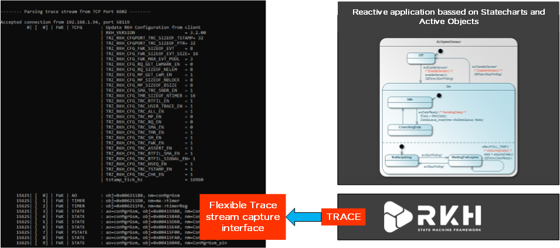

# Trazer - Visualization tool for RKH framework built in trace facility

## Documentation

Documentation exists in the [reference manual](https://vortexmakes.com/rkh/trazer.html).
Also, additional information is located in the  official site 
https://www.vortexmakes.com/. For now, it is in Spanish.

## Running
Trazer [Releases](https://github.com/dariosb/Trazer/releases) brings ready to use executables for linux and windows platforms.
A simple command line options are used for configure Trazer behaviour

         -s Symbol load from binary stream file
         -f Parse from binary stream file
         -c Parse from COM Port
              COM Port setup must be specified ex:
              trazer -c COM1 115200 8N1.
         -t Parse from specified TCP port number
         -o Produce output to the specified file
         -q Quiet mode
         -v Version info
         -h (help)
         
### Examples:
#### TCP
Trazer as a Socket server that listen on specific port.

`trazer -t 1662`
        
#### Serial
Trazer reading from serial port at specific baudrate and format.

`trazer -c COM1 115200 8N1`
        
#### Offline
Trazer can proccess trace information from a file previusly captured.

`trazer -f filename`

## Building
If you need to recompile for an specific you can start with this supported builds:

### Linux
Makefile build on: \arch\linux_gnu\Makefile

### Windows
Open and build Visual Studio Project (2008-2017) on: arch\win_vc08\prj\trazer.sln

## Trazer Release notes

[V3.2] RKHV2.4.05 Compatibility DD/MM/YYY
- -s option for load symbols binary file

[V3.1] RKHV2.4.05 Compatibility 29/06/2018
- Enlarge stream buffers
- Fix User Trace parser.

[V3.0] RKHV2.4.05 Compatibility 08/03/2017
- Refactoring for unity test of tzparser.
- unitrazer.lib library for embedd trazer parser on any RKH project,
  instead of use it as a external tool.
- Add event identification number (sequence number),
  to track post and dispatch instance, on responce time calculation.
- Replace RKH_TE_SMA_DCH by RKH_TE_SMA_GET for responce time calculation.
- Add pool id list of symbol (symbols adds with RKH_TE_FWK_EPOOL trace evt),
 for implement id by symbol replacement on events that sends poolid as argument.
 symilar to symboltbl but instead of obj address, with the poolid.

[V2.4] RKHV2.4.05 Compatibility 28/04/2016
- Sequence diagram online generation in msc lenguage
  compatible with MSC-generator-v4.5.
- UnitTrazer. TDD harness framework with RKH and Trazer.

[V2.3] RKHV2.4.04 Compatibility 07/07/2014
- Changes in trace config event (RKH_TR_FWK_TCFG) format.
- Timestamp and sequence number visibility according
  to current configuration.
- Sync with lates RKH trace events ordering.
- Signal Responce Time measurement functionality Added.
  To run properly, RKH Application must:
  - define in rkhcfg.h:
                        RKH_CFG_TRC_TSTAMP_EN    RKH_ENABLED
                        RKH_CFG_TRC_SMA_EN        RKH_ENABLED
                        RKH_CFG_TRC_SM_DCH_EN   RKH_ENABLED
  - if RKH_CFG_TRC_RTFIL_EN are RKH_ENABLED, set to OFF filters:
                        RKH_FILTER_OFF_EVENT( RKH_TE_SMA_LIFO );
                        RKH_FILTER_OFF_EVENT( RKH_TE_SMA_FIFO );
                        RKH_FILTER_OFF_EVENT( RKH_TE_SMA_DCH );
- If enabled, show sender information on post fifo/lifo trace events.
- Support of Seqdiag file generation.

[V2.2] RKHV2.4.03 Compatibility 02/06/2013
- If enabled, show sender information on post fifo/lifo trace events.
- Seqdiag file generation is now supported.
- Removeed '&' prefix from symbols objects visualization.

[V2.0] RKHV2.3 Compatibility 01/02/2013
- Set default RKH configuration when no config file found.
- Accepted configuration transmited by the target aplication.
- Supported user trace events.
- Added Linux port.
- Removed event format definition file. From this version Event Trace
  format is wired to RKH implementation.

[V1.0] Initial Version 07/04/2012
- This is the intial release of the Trazer visualization tool.
- This version is compatible to use with RKH V2.0
